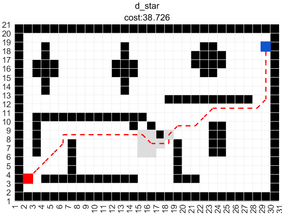
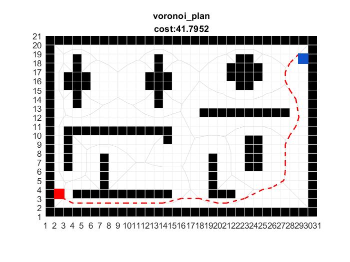
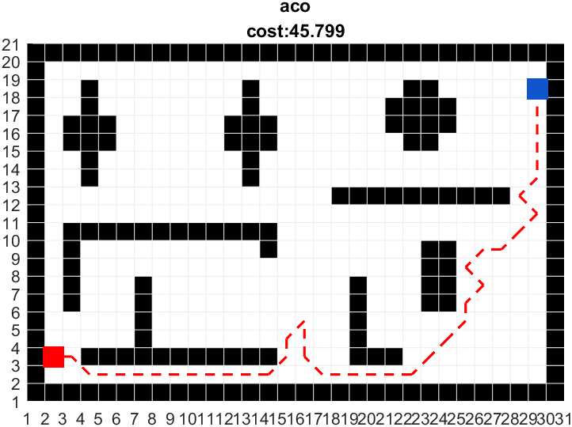

# Introduction

`Motion planning` plans the state sequence of the robot without conflict between the start and goal. 

`Motion planning` mainly includes `Path planning` and `Trajectory planning`.

* `Path Planning`: It's based on path constraints (such as obstacles), planning the optimal path sequence for the robot to travel without conflict between the start and goal.
* `Trajectory planning`: It plans the motion state to approach the global path based on kinematics, dynamics constraints and path sequence.

This repository provides the implement of common `Motion planning` algorithm, welcome your star & fork & PR.

This repository provides the implementation of common Motion Planning algorithms. The theory analysis can be found at [motion-planning](https://blog.csdn.net/frigidwinter/category_11410243.html). Furthermore, we provide [ROS C++](https://github.com/ai-winter/ros_motion_planning) and [Python](https://github.com/ai-winter/python_motion_planning) version.


# Quick Start

The file structure is shown below

```
├─gif
├─examples
│   ├─simulation_global.mlx
│   ├─simulation_local.mlx
│   ├─simulation_total.mlx
├─global_planner
│   ├─graph_search
│   ├─sample_search
│   └─evolutionary_search
├─local_planner
└─utils
```

The global planning algorithm implementation is in the folder `global_planner` with `graph_search`, `sample_search` and `evolutionary search`; The local planning algorithm implementation is in the folder `local_planner`.

To start simulation, open `./simulation_global.mlx` or `./simulation_local.mlx` and select the algorithm, for example

```matlab
clear all;
clc;

% load environment
load("gridmap_20x20_scene1.mat");
map_size = size(grid_map);
G = 1;

% start and goal
start = [3, 2];
goal = [18, 29];

% planner
planner_name = "rrt";

planner = str2func(planner_name);
[path, flag, cost, expand] = planner(grid_map, start, goal);

% visualization
clf;
hold on

% plot grid map
plot_grid(grid_map);
% plot expand zone
plot_expand(expand, map_size, G, planner_name);
% plot path
plot_path(path, G);
% plot start and goal
plot_square(start, map_size, G, "#f00");
plot_square(goal, map_size, G, "#15c");
% title
title([planner_name, "cost:" + num2str(cost)]);

hold off
```

# Version
## Global Planner

Planner      |    Version    | Animation   
------------ | --------- | --------- 
**GBFS**     | [](https://github.com/ai-winter/matlab_motion_planning/blob/master/global_planner/graph_search/gbfs.m)     | 
**Dijkstra**     | [](https://github.com/ai-winter/matlab_motion_planning/blob/master/global_planner/graph_search/dijkstra.m) | 
**A***     | [](https://github.com/ai-winter/matlab_motion_planning/blob/master/global_planner/graph_search/a_star.m) | 
**JPS**                 | [](https://github.com/ai-winter/matlab_motion_planning/blob/master/global_planner/graph_search/jps.m) |  
**D***              | [](https://github.com/ai-winter/matlab_motion_planning/blob/master/global_planner/graph_search/d_star.m) |  
**LPA***                 |  |  
**D\* Lite**                 |  |
**Voronoi**                 | [](https://github.com/ai-winter/matlab_motion_planning/blob/master/global_planner/graph_search/voronoi_plan.m) |  
**RRT**                 | [](https://github.com/ai-winter/matlab_motion_planning/blob/master/global_planner/sample_search/rrt.m) | 
**RRT***               | [](https://github.com/ai-winter/matlab_motion_planning/blob/master/global_planner/sample_search/rrt_star.m) |
**Informed RRT**        | [](https://github.com/ai-winter/matlab_motion_planning/blob/master/global_planner/sample_search/informed_rrt.m) |
**RRT-Connect**               | [](https://github.com/ai-winter/matlab_motion_planning/blob/master/global_planner/sample_search/rrt_connect.m) |

## Local Planner
| Planner |  Version    | Animation                                             |
| ------- | -------------------------------------------------------- | -------------------------------------------------------- | 
| **PID**   | [](https://github.com/ai-winter/matlab_motion_planning/blob/master/local_planner/pid.m) | 
| **APF**   |  |  
| **DWA**  | [](https://github.com/ai-winter/matlab_motion_planning/blob/master/local_planner/dwa.m) | 
| **TEB** |  |  
| **MPC** |  |  
| **Lattice** |  |  

## Intelligent Algorithm

| Planner | Version    | Animation                                                 |
| ------- | -------------------------------------------------------- | -------------------------------------------------------- 
| **ACO** | [](https://github.com/ai-winter/matlab_motion_planning/blob/master/global_planner/evolutionary_search/aco.m) | 
| **GA**  |  |  
| **PSO** |  |  
| **ABC** |  |  


# Papers
## Search-based Planning
* [A*: ](https://ieeexplore.ieee.org/document/4082128) A Formal Basis for the heuristic Determination of Minimum Cost Paths
* [JPS:](https://ojs.aaai.org/index.php/AAAI/article/view/7994) Online Graph Pruning for Pathfinding On Grid Maps
* [Lifelong Planning A*: ](https://www.cs.cmu.edu/~maxim/files/aij04.pdf) Lifelong Planning A*
* [D*: ](http://web.mit.edu/16.412j/www/html/papers/original_dstar_icra94.pdf) Optimal and Efficient Path Planning for Partially-Known Environments
* [D* Lite: ](http://idm-lab.org/bib/abstracts/papers/aaai02b.pdf) D* Lite

## Sample-based Planning
* [RRT: ](http://msl.cs.uiuc.edu/~lavalle/papers/Lav98c.pdf) Rapidly-Exploring Random Trees: A New Tool for Path Planning
* [RRT-Connect: ](http://www-cgi.cs.cmu.edu/afs/cs/academic/class/15494-s12/readings/kuffner_icra2000.pdf) RRT-Connect: An Efficient Approach to Single-Query Path Planning
* [RRT*: ](https://journals.sagepub.com/doi/abs/10.1177/0278364911406761) Sampling-based algorithms for optimal motion planning
* [Informed RRT*: ](https://arxiv.org/abs/1404.2334) Optimal Sampling-based Path Planning Focused via Direct Sampling of an Admissible Ellipsoidal heuristic

## Evolutionary-based Planning
* [ACO: ](http://www.cs.yale.edu/homes/lans/readings/routing/dorigo-ants-1999.pdf) Ant Colony Optimization: A New Meta-Heuristic

## Local Planning

* [DWA: ](https://www.ri.cmu.edu/pub_files/pub1/fox_dieter_1997_1/fox_dieter_1997_1.pdf) The Dynamic Window Approach to Collision Avoidance